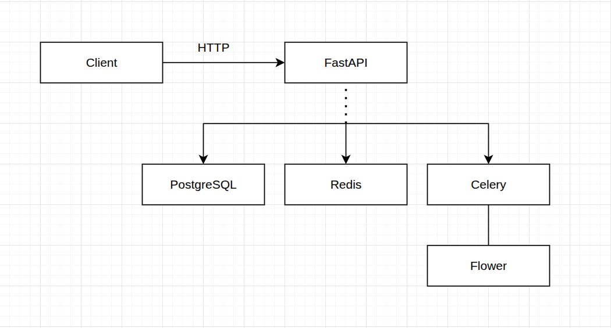

# Device Analytics Service

REST-сервис для сбора и анализа телеметрии с устройств. Реализован на **FastAPI + PostgreSQL + Celery + Redis**, разворачивается через **Docker Compose**.

---

## Архитектура


### Компоненты

| Сервис | Описание |
|---|---|
| `api` | FastAPI-приложение, 4 воркера Uvicorn |
| `db` | PostgreSQL 16 — основное хранилище |
| `redis` | Redis 7 — брокер Celery + бэкенд результатов |
| `celery_worker` | Воркеры для асинхронной аналитики |
| `flower` | Веб-UI мониторинга Celery задач (`:5555`) |
| `locust` | Нагрузочное тестирование (`:8089`, профиль `loadtest`) |

### Структура проекта

```
device_analytics/
├── app/
│   ├── api/v1/
│   │   ├── analytics.py   # Эндпоинты аналитики (sync + async)
│   │   ├── devices.py     # CRUD устройств
│   │   ├── measurements.py# Приём телеметрии
│   │   ├── users.py       # CRUD пользователей
│   │   └── router.py
│   ├── core/config.py     # Настройки (pydantic-settings)
│   ├── db/database.py     # Async SQLAlchemy engine
│   ├── models/models.py   # ORM-модели: User, Device, Measurement
│   ├── schemas/schemas.py # Pydantic-схемы запросов/ответов
│   ├── services/analytics.py  # Бизнес-логика расчёта статистики
│   ├── tasks/celery_app.py    # Celery-приложение и задачи
│   └── main.py
├── locust/locustfile.py   # Сценарии нагрузочных тестов
├── tests/                 # Юнит-тесты
├── Dockerfile
├── Dockerfile.locust
├── docker-compose.yml
├── startup.py             # Init-скрипт (ожидание БД + создание таблиц)
└── requirements.txt
```

---

## Модели данных

### User
```
id          UUID PK
username    VARCHAR(100) UNIQUE
email       VARCHAR(255) UNIQUE
created_at  TIMESTAMP WITH TZ
```

### Device
```
id          UUID PK
name        VARCHAR(100)
description VARCHAR(500)
owner_id    UUID FK → users.id (nullable)
created_at  TIMESTAMP WITH TZ
```

### Measurement
```
id          UUID PK
device_id   UUID FK → devices.id
x           FLOAT
y           FLOAT
z           FLOAT
timestamp   TIMESTAMP WITH TZ  [INDEX: (device_id, timestamp)]
```

---

## Запуск

### Требования
- Docker 24+
- Docker Compose v2

### Быстрый старт

```bash
# Клонировать репозиторий
git clone <repo_url>
cd device_analytics

# Запустить сервисы
docker compose up -d

# Проверить здоровье
curl http://localhost:8000/health
```

### С нагрузочным тестированием

```bash
docker compose --profile loadtest up -d
# Открыть http://localhost:8089 для Locust UI
```

### Мониторинг Celery

Открыть http://localhost:5555 для Flower UI.

### Интерактивная документация

- Swagger UI: http://localhost:8000/api/v1/openapi.json
- OpenAPI docs: http://localhost:8000/docs

---

## API Reference

### Users

| Метод | Путь | Описание |
|---|---|---|
| `POST` | `/api/v1/users/` | Создать пользователя |
| `GET` | `/api/v1/users/` | Список пользователей |
| `GET` | `/api/v1/users/{user_id}` | Пользователь с его устройствами |

```bash
# Создать пользователя
curl -X POST http://localhost:8000/api/v1/users/ \
  -H "Content-Type: application/json" \
  -d '{"username": "alice", "email": "alice@example.com"}'
```

### Devices

| Метод | Путь | Описание |
|---|---|---|
| `POST` | `/api/v1/devices/` | Зарегистрировать устройство |
| `GET` | `/api/v1/devices/` | Список устройств |
| `GET` | `/api/v1/devices/{device_id}` | Данные устройства |

```bash
# Зарегистрировать устройство
curl -X POST http://localhost:8000/api/v1/devices/ \
  -H "Content-Type: application/json" \
  -d '{"name": "Sensor-01", "owner_id": "<user_id>"}'
```

### Measurements (телеметрия)

| Метод | Путь | Описание |
|---|---|---|
| `POST` | `/api/v1/devices/{device_id}/measurements` | Записать показание |
| `GET` | `/api/v1/devices/{device_id}/measurements` | История показаний |

```bash
# Отправить показание
curl -X POST http://localhost:8000/api/v1/devices/<device_id>/measurements \
  -H "Content-Type: application/json" \
  -d '{"x": 1.23, "y": -0.45, "z": 9.81}'
```

### Analytics

| Метод | Путь | Описание |
|---|---|---|
| `GET` | `/api/v1/analytics/devices/{device_id}` | Синхронная аналитика устройства |
| `GET` | `/api/v1/analytics/users/{user_id}` | Синхронная аналитика пользователя |
| `POST` | `/api/v1/analytics/devices/{device_id}/async` | Поставить задачу в очередь |
| `POST` | `/api/v1/analytics/users/{user_id}/async` | Поставить задачу в очередь |
| `GET` | `/api/v1/analytics/tasks/{task_id}` | Получить результат задачи |

Query-параметры для фильтрации периода:
- `period_from` — ISO 8601 datetime (например `2024-01-01T00:00:00`)
- `period_to` — ISO 8601 datetime

```bash
# Аналитика за всё время
curl "http://localhost:8000/api/v1/analytics/devices/<device_id>"

# Аналитика за период
curl "http://localhost:8000/api/v1/analytics/devices/<device_id>?period_from=2024-01-01T00:00:00&period_to=2024-12-31T23:59:59"

# Асинхронная аналитика
TASK=$(curl -s -X POST "http://localhost:8000/api/v1/analytics/devices/<device_id>/async" | jq -r .task_id)
curl "http://localhost:8000/api/v1/analytics/tasks/$TASK"
```

### Пример ответа аналитики

```json
{
  "device_id": "550e8400-e29b-41d4-a716-446655440000",
  "period_from": null,
  "period_to": null,
  "x": { "min": -9.8, "max": 9.8, "count": 1000, "sum": 120.5, "median": 0.12 },
  "y": { "min": -5.1, "max": 5.3, "count": 1000, "sum": -30.2, "median": -0.05 },
  "z": { "min": 8.9,  "max": 10.1,"count": 1000, "sum": 9810.0,"median": 9.81 }
}
```

---

## Асинхронная аналитика (Celery)

Тяжёлые вычисления (большие временные периоды, агрегация по всем устройствам пользователя) можно выполнить асинхронно:

1. `POST /analytics/devices/{id}/async` → получить `task_id`
2. Polling `GET /analytics/tasks/{task_id}` → статус `pending | running | success | failed`
3. При `success` — результат доступен в поле `result`

Задачи видны в Flower (`http://localhost:5555`).

---

## Тесты

```bash
# Запустить юнит-тесты
docker compose run --rm api pytest tests/ -v
```